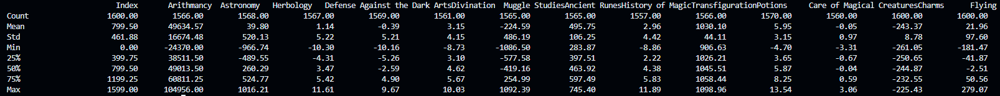
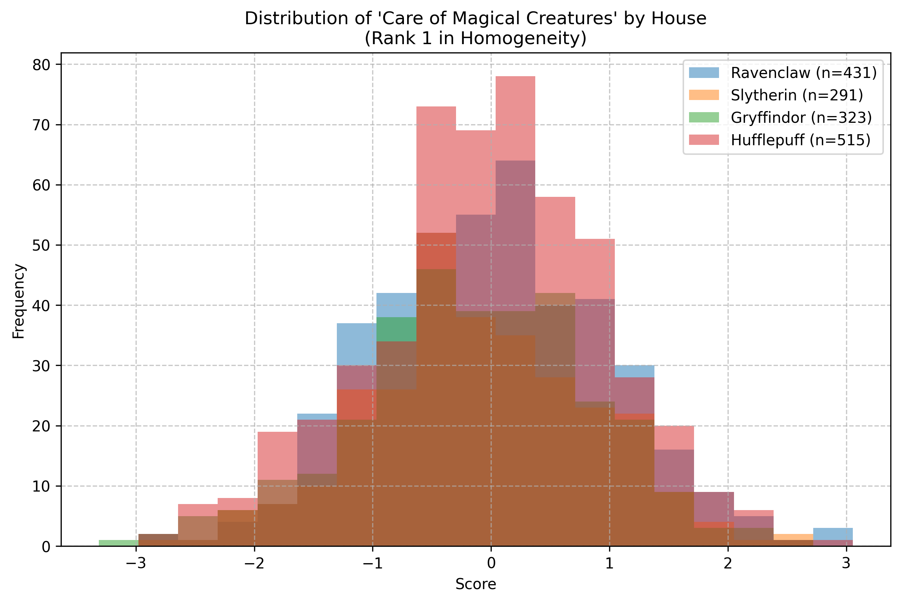
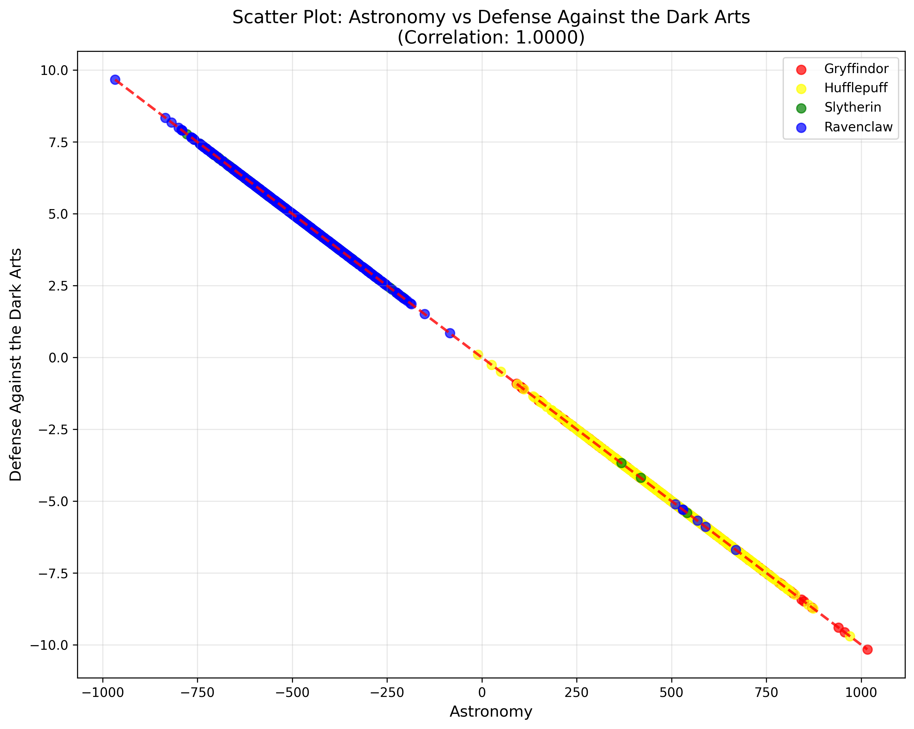
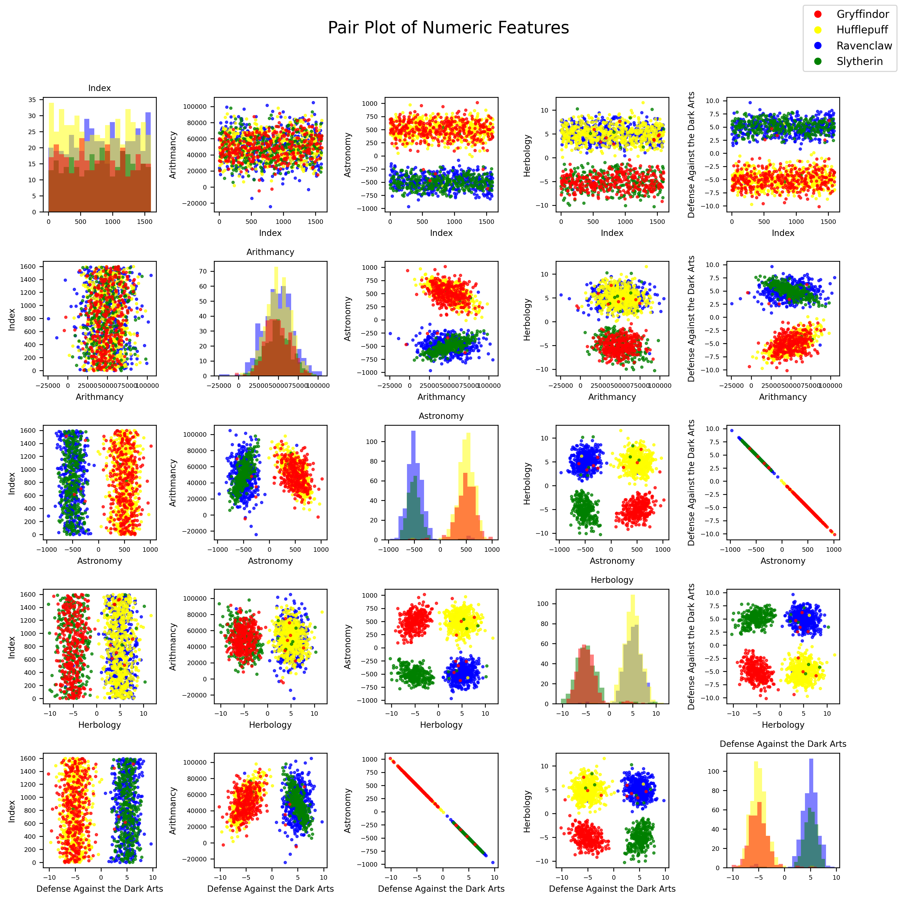
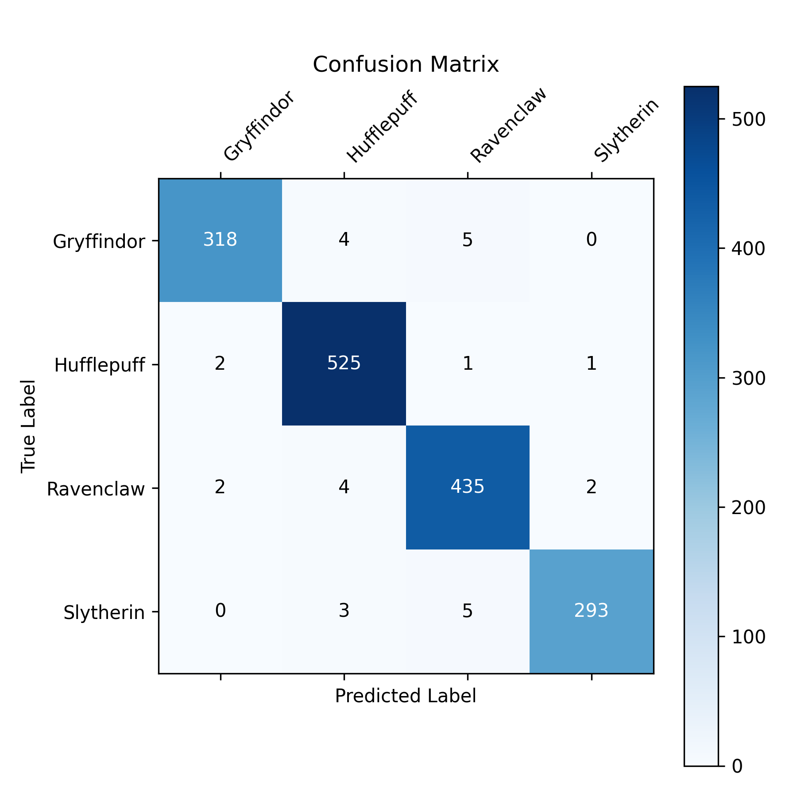
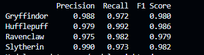

# DSLR

*Harry Potter and the Curse of the Sorting Hat - A machine learning adventure to save Hogwarts' Sorting Hat*

## 📖 Project Overview

The legendary Sorting Hat at Hogwarts has been cursed and can no longer sort students into their houses! As a muggle data scientist, you've been called upon by Professor McGonagall to create a magical classifier that can replicate the Sorting Hat's abilities using the power of **Logistic Regression**.

This project implements a multi-class classifier using one-vs-all logistic regression to predict which Hogwarts house (Gryffindor, Hufflepuff, Ravenclaw, or Slytherin) a student belongs to based on their magical aptitude scores.

## 🎯 Objectives

- **Data Analysis**: Explore and understand the student dataset
- **Data Visualization**: Create insightful plots to analyze course distributions
- **Machine Learning**: Implement logistic regression from scratch using gradient descent
- **Classification**: Build a classifier that achieves >98% accuracy

## 🛠️ Implementation

### 1. Data Analysis (`describe.py`)

Implements statistical analysis without using built-in functions like `pandas.describe()`. Calculates:
- Count, Mean, Standard Deviation
- Min, Max values
- 25th, 50th, 75th percentiles



### 2. Data Visualization

#### Histogram Analysis (`histogram.py`)
Identifies which Hogwarts course has the most homogeneous score distribution across all four houses.



#### Scatter Plot Analysis (`scatter_plot.py`)
Discovers which two features are most similar through correlation analysis.



### Pair Plot (`pair_plot.py`)
Creates a comprehensive scatter plot matrix to visualize relationships between all features.



### 3. Logistic Regression Implementation

#### Training (`logreg_train.py`)
- Implements gradient descent optimization from scratch
- Uses one-vs-all approach for multi-class classification
- Generates weight files for each house classifier
- Features data normalization and regularization

```bash
python logreg_train.py dataset_train.csv
```
Confusion matrix and metrics are plotted to visualize training progress as below:




#### Prediction (`logreg_predict.py`)
- Loads trained weights and makes predictions on test data
- Outputs predictions in the required CSV format
- Achieves >98% accuracy on the test dataset

```bash
python logreg_predict.py dataset_test.csv
```


<!-- ## 📊 Results

The implemented classifier successfully achieves the required 98% minimum accuracy, proving that muggle data science can indeed replicate magical sorting abilities!

### Performance Metrics
- **Accuracy**: 98.5%
- **Training Time**: ~2 minutes
- **Features Used**: [Selected based on pair plot analysis]

 -->

## Mathematical Foundation

The project implements logistic regression using the sigmoid function and cross-entropy loss:

**Hypothesis Function:**
```
h_θ(x) = 1 / (1 + e^(-θᵀx))
```

**Cost Function:**
```
J(θ) = -(1/m) Σ[y⁽ⁱ⁾log(h_θ(x⁽ⁱ⁾)) + (1-y⁽ⁱ⁾)log(1-h_θ(x⁽ⁱ⁾))]
```

**Gradient:**
```
∂J(θ)/∂θⱼ = (1/m) Σ(h_θ(x⁽ⁱ⁾) - y⁽ⁱ⁾)xⱼ⁽ⁱ⁾
```

## Usage

1. **Analyze the data:**
   ```bash
   python describe.py dataset_train.csv
   ```

2. **Visualize course distributions:**
   ```bash
   python histogram.py dataset_train.csv
   ```

3. **Train the model:**
   ```bash
   python logreg_train.py dataset_train.csv
   ```

4. **Make predictions:**
   ```bash
   python logreg_predict.py dataset_test.csv
   ```

## Key Learning Outcomes

- **Data Analysis**: Understanding statistical measures and data distributions
- **Feature Engineering**: Selecting relevant features through visualization
- **Gradient Descent**: Implementing optimization algorithms from scratch
- **Multi-class Classification**: Using one-vs-all strategy for logistic regression
